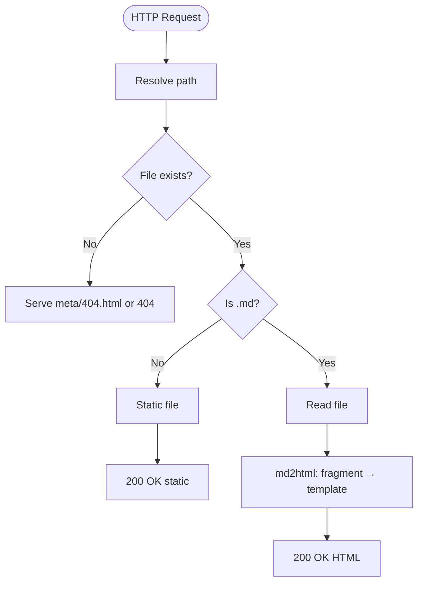
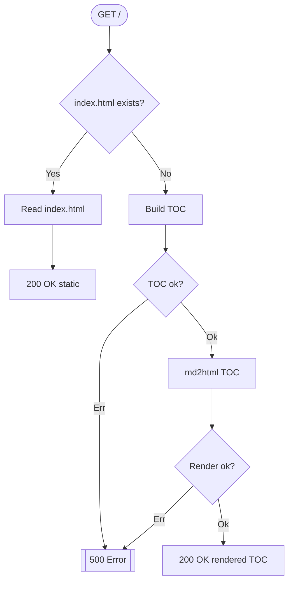

# my-http-server

[](https://github.com/Paul-16098/my-http-server/actions/workflows/cli.yml) [](https://github.com/Paul-16098/my-http-server/actions/workflows/Security-audit.yml) [](https://github.com/Paul-16098/my-http-server/actions/workflows/docker-publish.yml) [](https://github.com/Paul-16098/my-http-server/actions/workflows/docker-test.yml)

## Project Name and Description

輕量級的「Markdown → HTML」伺服器（Rust + actix-web）。請求 `.md` 會即時渲染為 HTML（以 `meta/html-t.templating` 為外殼），其餘路徑走靜態檔；提供可選 Hot Reload 的模板與配置，低入侵中介層（NormalizePath/Compress/Logger）。

## Technology Stack

- Language: Rust (edition 2024) · Crate version: 3.0.2
- Web: actix-web 4.11.0, actix-files 0.6.8
- TLS: rustls 0.23, rustls-pemfile 2.2.0 (optional HTTPS support)
- Templating: mystical-runic 0.5.3（啟用 bytecode cache；可 hot reload）
- Markdown: markdown-ppp 2.7.1（AST → HTML fragment）
- Config & Utils: config 0.15.x, once_cell 1.x, serde 1.x, clap 4.5.x, env_logger 0.11.x, log 0.4.x, percent-encoding 2.3.x, wax 0.6.x, thiserror 2.x, nom 8.x, nest_struct 0.5.x

## Project Architecture

- HTTP/路由：`src/request.rs`（`GET /` 與 `GET /{filename:.*}`）、`src/main.rs`（伺服器組裝與中介層）、`src/http_ext.rs`（每請求快取）。
- 轉換：`src/parser/{markdown.rs, templating.rs}`（Markdown → fragment → 模板外殼）。
- 設定：`src/cofg/{cofg.rs, cofg.yaml}`（全域快取；可選熱重載）。

簡易流程（md 請求）：

```text
HTTP -> route -> 解析 public_path 實體路徑
  -> .md? 是: read_to_string -> md2html(fragment -> template)
       否: NamedFile 靜態回應
```

Mermaid：



Index 路由（`/`）簡化流程：



索引：`/` 若有 `public/index.html` 直接回傳；否則即時產出 TOC（依 `toc.ext`）後套模板。

## Getting Started

Prerequisites：Rust（stable）。

1. 建立最小模板與內容

```html
<!-- meta/html-t.templating -->
<!DOCTYPE html><meta charset="utf-8" />
<html>
  <body>
    {{ body }}
  </body>
</html>
```

```html
<!-- meta/404.html -->
<!DOCTYPE html><meta charset="utf-8" />
<h1>404 Not Found</h1>
```

```pwsh
New-Item -Type Directory -Force public,meta | Out-Null
"# Hello`n`n這是首頁。" | Set-Content -Encoding UTF8 public\index.md
cargo run
```

預設位址：`http://127.0.0.1:8080/`。首次若缺模板，程式會寫入預設並退出，請再執行一次。

### Configuration（cofg.yaml）

[cofg.yaml](src/cofg/cofg.yaml)

### TLS/HTTPS Support

TLS/HTTPS is supported using rustls. Configure in `cofg.yaml`:

```yaml
tls:
  enable: true
  cert: ./cert.pem
  key: ./key.pem
```

Or use CLI arguments:

```bash
cargo run -- --tls-cert ./cert.pem --tls-key ./key.pem
```

**Generate self-signed certificate for testing:**

```bash
# Using OpenSSL
openssl req -x509 -newkey rsa:4096 -keyout key.pem -out cert.pem -days 365 -nodes -subj "/CN=localhost"

# Using mkcert (recommended for local development)
mkcert -install
mkcert localhost 127.0.0.1 ::1
mv localhost+2.pem cert.pem
mv localhost+2-key.pem key.pem
```

When TLS is enabled, the server will bind to HTTPS instead of HTTP. The server logs will indicate `https://` instead of `http://`.

## Project Structure

```tree
src/
  cofg/        # 設定讀取與快取（OnceCell + RwLock）
  parser/      # Markdown / 模板 / TOC
  request.rs   # 路由與處理邏輯
  http_ext.rs  # 每請求 Extension 快取
  main.rs      # 伺服器組裝與中介層
meta/          # 模板與 404（自行建立）
public/        # 網站內容（自行建立）
```

## Key Features

- 即時 Markdown → HTML（模板外殼 `meta/html-t.templating`；注入 `server-version` 與每頁 `path`）。
- TOC：`/` 自動生成導覽（無 `index.html` 時）。
- 每請求快取：decoded URI、public 路徑、是否為 Markdown，避免重複計算。
- 可選 Hot Reload：`templating.hot_reload=true` 時每次重建模板引擎；`Cofg::get(true)` 僅在該旗標為真時生效。

## Development Workflow

- Build/Run：`cargo run`；Release：`cargo build --release`
- Test（推薦）：`cargo nextest run --no-fail-fast`（VS Code 任務：`cargo: nextest`）
- Docker：`docker build -t my-http-server .`；或 `docker compose up -d --build`
- 常見分支：預設分支 `dev`（本檔反映目前代碼狀態）

## Coding Standards（Project-specific）

- 保持 `md2html` 為純函式；批次工具使用 `_md2html_all()`，勿接入啟動流程。
- 熱路徑避免 `Cofg::get(true)`；測試/管理操作另行使用。
- 新增 middleware 採 `.wrap(Condition::new(flag, M::new()))`。
- 新增設定需同步：`src/cofg/cofg.yaml`、`Cofg` 結構、`BUILD_COFG` 內嵌預設。
- 路徑安全：目前未強制 canonical prefix；若內容根不受信，務必先加前綴檢查避免 traversal。

## Testing

- 範圍：設定載入/熱重載、模板 context、Markdown → HTML、TOC 生成、HTTP 行為。
- 位置：`src/test/*.rs`
- 執行：

```pwsh
cargo nextest run --no-fail-fast
```

## Contributing

歡迎貢獻！請遵循以下流程與規範：

- 從預設分支 `dev` 建立功能分支，提交 PR 前請同步最新 `dev`。
- 測試：新增/更新對應測試（`src/test/*.rs`），並執行 `cargo test` 確認通過。
- 品質：執行 `cargo clippy -- -D warnings`（若 CI 尚未強制）。
- 原則：
  - 保持 `md2html` 純函式；批次工具用 `_md2html_all()`，勿耦合啟動流程。
  - 熱路徑避免 `Cofg::get(true)`；僅在測試/管理操作使用。
  - 新增設定需同步：`src/cofg/cofg.yaml`、`Cofg` 結構、`BUILD_COFG` 內嵌預設。
  - 中介層採 `.wrap(Condition::new(flag, M::new()))` 模式。
- 參考文件：
  - `developer-guide.md`（開發流程、測試策略、常見工作）
  - `key-functions.md`（關鍵函式與設計理由；作為實作風格範例）

## Docker

建置與執行：

```pwsh
docker build -t my-http-server .
docker run --rm -p 8080:8080 `
  -v ${PWD}/public:/app/public `
  -v ${PWD}/cofg.yaml:/app/cofg.yaml `
  my-http-server
```

docker-compose（推薦）：

```pwsh
docker compose up -d --build
```

注意：如掛載自備 `meta/`，需同時提供 `meta/html-t.templating` 與 `meta/404.html`。

## FAQ

- 啟動失敗：Port 被占用？調整 `addrs.port`。
- 空白頁或 404：確認 `meta/html-t.templating`、`meta/404.html` 與 `public/` 是否齊備。
- 變更未生效：開啟 `templating.hot_reload=true` 或重啟。
- 重複解析大檔：可考慮未來導入 (path, mtime) HTML 快取（目前未內建）。

## 參考文件

- [architecture.md](architecture.md) — 系統架構與資料流
- [request-flow.md](request-flow.md) — 路由流程與時序圖（Mermaid）
- [key-functions.md](key-functions.md) — 關鍵函式與設計理由
- [performance-cache.md](performance-cache.md) — 效能與快取筆記
