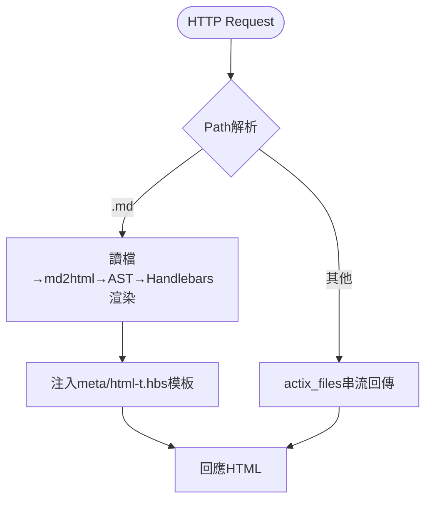

# My HTTP Server

## Project Name and Description

my-http-server 是高效能 Rust HTTP 伺服器，支持靜態檔案與 Markdown 動態渲染，結合 Actix-web、Handlebars 模板、IP 過濾、速率限制等多種中介軟體，適合文檔站、靜態資源服務與自訂化內容分發。

## Technology Stack

- **語言**: Rust (Edition 2024)
- **主要框架/函式庫**:
  - actix-web 4.11.0
  - actix-files 0.6.8
  - handlebars 6.3.2
  - markdown-ppp 2.7.1
  - actix-ip-filter 0.3.2
  - actix-governor 0.10.0
  - utoipa 5.4.0 (OpenAPI, optional)
  - rustls 0.23 (TLS)
  - wax 0.6.0 (glob)
  - clap 4.5.49 (CLI)

## Project Architecture

## 高層流程

## 模組職責

- `src/request.rs`：路由主控
- `src/main.rs`：伺服器啟動與中介軟體鏈
- `src/parser/mod.rs`：Markdown解析、HTML渲染、模板注入
- `src/parser/templating.rs`：Handlebars引擎、上下文DSL
- `src/cofg/config.rs`：全域設定快取
- `src/error.rs`：統一錯誤型別與 HTTP 回應

## Getting Started

### 安裝與啟動

1. 安裝 Rust (<https://rustup.rs>)
2. clone 本專案
3. `cargo run` 首次啟動會自動生成預設 `meta/html-t.hbs`，需再次執行
4. 若需 TLS，請於 `cofg.yaml` 設定 `tls.cert` 與 `tls.key`
5. 若啟用 github_emojis features，請設置對應環境變數

### 配置

- 所有設定集中於 `cofg.yaml`，支援熱重載（dev模式下）
- 模板變數可於 `templating.value` 設定，支援 env 注入

## 測試

- 單元測試：`cargo make test`（涵蓋核心模組、middleware、auth、IP 過濾）

## Project Structure

- `src/`：主程式碼
  - `main.rs`、`request.rs`：HTTP 路由與伺服器
  - `parser/`：Markdown/模板處理
  - `cofg/`：設定管理
  - `error.rs`：錯誤型別
- `meta/`：模板與自訂 404 頁面
- `public/`：靜態檔案根目錄
- `docs/`：開發文檔、架構、流程、功能說明

## Key Features

- Markdown 檔案即時渲染為 HTML，支援自訂模板
- 靜態檔案高效串流
- 中介軟體鏈：速率限制、Logger、路徑正規化、壓縮、BasicAuth、IP 過濾
- 設定熱重載（dev模式）
- TOC 自動生成與快取
- 支援 TLS (rustls)
- API 文件自動生成（/api, Swagger UI）

## Development Workflow

- 預設分支：`dev`
- 開發流程：
  1. `cargo run` 啟動伺服器
  2. 發佈：`cargo build --release`
- 分支策略：功能/修正分支合併至 `dev`，PR 審查後進主分支

## Coding Standards

- 遵循 Rust 社群最佳實踐
- 強制使用 `clippy`（`cargo clippy -- -D warnings`）
- WHY 註解：只解釋「為什麼」而非「做什麼」
- 函數需標註輸入/輸出/錯誤/副作用/效能/安全性
- 重要邏輯中英雙語註解

## Testing

- 單元測試：`src/test/*.rs`（涵蓋 parser、middleware、auth、IP 過濾等）
- 集成測試：涵蓋中介軟體鏈、API 路由
- 靜態分析：`cargo clippy`

## Contributing

- 請先閱讀 `docs/developer-guide.md`，理解 mental model 與常見任務
- 參考 `src/test/*.rs` 及 `docs/key-functions.md` 範例
- 新增模板變數請於 `cofg.yaml` 的 `templating.value` 設定
- 新增中介軟體請於 `main.rs` 的 `build_server` 組合
- 提交前請確保所有測試通過，程式碼經 `clippy` 檢查
