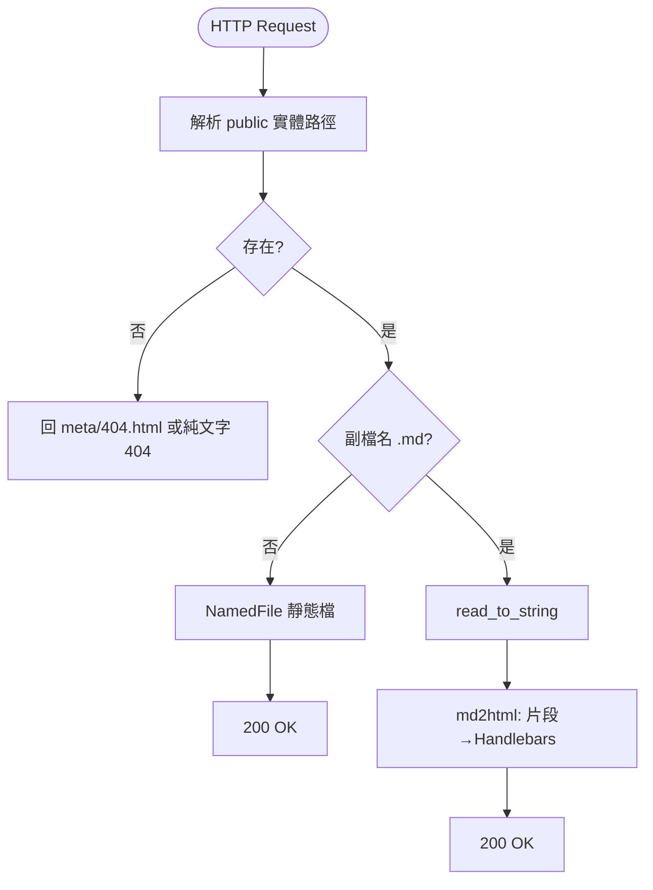
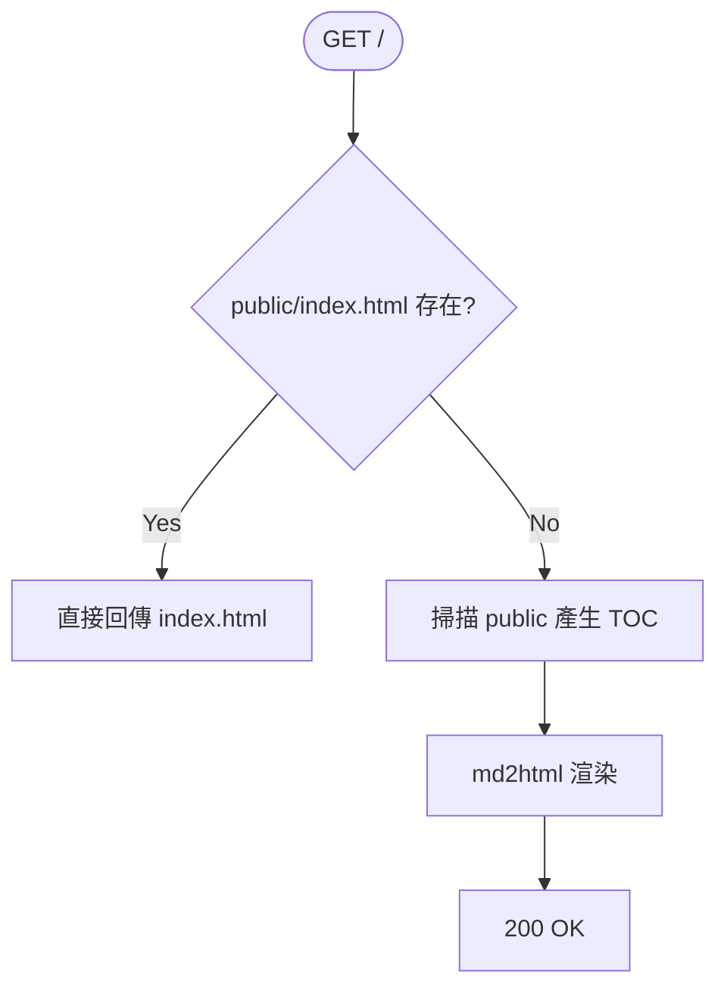

# my-http-server

[](https://github.com/Paul-16098/my-http-server/actions/workflows/cli.yml) [](https://github.com/Paul-16098/my-http-server/actions/workflows/Security-audit.yml) [](https://github.com/Paul-16098/my-http-server/actions/workflows/docker-publish.yml) [](https://github.com/Paul-16098/my-http-server/actions/workflows/docker-test.yml)

## Project Name and Description

輕量級 Markdown → HTML 靜態/動態伺服器（Rust + Actix）。請求到的 `.md` 檔會在執行時轉為 HTML 片段並套用 Handlebars 模板外殼（`meta/html-t.hbs`）；其它副檔名則直接以靜態檔回應。首頁在缺乏 `public/index.html` 時會動態建立 TOC（目錄）再渲染。設定採全域快取並支援可選的模板熱重載。

## Technology Stack

- Language: Rust (edition 2024) · Crate version: 3.0.2
- Web: actix-web 4.11.0, actix-files 0.6.8
- Security: actix-ip-filter 0.3.2 (IP filtering with glob pattern support)
- Templating: mystical-runic 0.5.3（啟用 bytecode cache；可 hot reload）
- Markdown: markdown-ppp 2.7.1（AST → HTML fragment）
- Config & Utils: config 0.15.x, once_cell 1.x, serde 1.x, clap 4.5.x, env_logger 0.11.x, log 0.4.x, percent-encoding 2.3.x, wax 0.6.x, thiserror 2.x, nom 8.x, nest_struct 0.5.x

## Project Architecture

- HTTP/路由：`src/request.rs`（`GET /` 與 `GET /{filename:.*}`）· `src/main.rs`（伺服器組裝與中介層）· `src/http_ext.rs`（每請求快取）
- 轉換：`src/parser/{markdown.rs, templating.rs, mod.rs}`（Markdown → HTML 片段 → 模板渲染）
- 設定：`src/cofg/{config.rs, cofg.yaml}`（快取 + 可選熱重載）

流程（Markdown 請求）：



首頁（`/`）簡化：



更多細節請見 `architecture.md` 與 `request-flow.md`。

## Getting Started

1. 啟動伺服器（預設會使用倉庫內的 `meta/` 與 `public/` 範例）

```pwsh
cargo run
```

預設位址：`http://127.0.0.1:8080/`。首次若缺模板，程式會寫入預設並退出，請再執行一次。

### Configuration（cofg.yaml）

[cofg.yaml](src/cofg/cofg.yaml)

## Project Structure

```text
src/
  cofg/        # 設定載入與快取（OnceCell + RwLock）
  parser/      # Markdown 解析、模板、TOC
  request.rs   # 路由與處理流程（/ 與 /{filename:.*}）
  http_ext.rs  # 每請求 Extension 快取（路徑/副檔名等）
  main.rs      # 伺服器組裝與中介層
meta/          # Handlebars 模板與 404 頁面（本倉庫已提供樣板）
public/        # 網站內容（本倉庫提供範例，可自行替換）
```

更多說明可參考 `config-templating-map.md`。

## Key Features

- 即時 Markdown → HTML：以 `md2html` 管線產生 HTML 片段並套用 `meta/html-t.hbs`
- 首頁/目錄 TOC：`/` 無 `index.html` 時即時掃描 `public/`（依 `toc.ext`）並渲染
- 每請求快取：`decoded_uri`、`filename_path`、`public_req_path`、`is_markdown`
- 模板熱重載（可選）：`templating.hot_reload=true` 時每次重建引擎；設定強制重讀需顯式 `Cofg::get(true)`
- 靜態檔快速回應：非 `.md` 直接 `NamedFile::open_async`
- 可自訂 `meta/404.html`
- **IP 過濾器**：支援白名單/黑名單模式，使用 glob 模式匹配 IP 位址（詳見 [docs/ip-filter.md](docs/ip-filter.md)）

## Development Workflow

- Run/Build：`cargo run`；`cargo build --release`
- Test：建議使用 nextest 加速輸出

```pwsh
cargo test
# 或
cargo nextest run --no-fail-fast
```

- Docker：

```pwsh
docker build -t my-http-server .
docker run --rm -p 8080:8080 `
  -v ${PWD}/public:/app/public `
  -v ${PWD}/cofg.yaml:/app/cofg.yaml `
  my-http-server
```

**With TLS/HTTPS:**

```pwsh
docker run --rm -p 8443:8443 `
  -v ${PWD}/public:/app/public `
  -v ${PWD}/cofg.yaml:/app/cofg.yaml `
  -v ${PWD}/cert.pem:/app/cert.pem:ro `
  -v ${PWD}/key.pem:/app/key.pem:ro `
  my-http-server --ip 0.0.0.0 --port 8443 --tls-cert /app/cert.pem --tls-key /app/key.pem
```

或使用 Compose（倉庫已提供）：

```pwsh
docker compose up -d --build
```

預設協作分支：`dev`。

## Coding Standards

- 保持 `md2html` 為純入口；模板引擎/Context 副作用已封裝於 `parser/templating.rs`
- 熱路徑避免強制重讀設定：不要在請求處理流程呼叫 `Cofg::get(true)`
- 新增中介層以 `.wrap(Condition::new(flag, M::new()))` 方式組裝於 `main.rs`
- 新增設定須同步三處：`src/cofg/cofg.yaml`、`Cofg` 結構、內嵌預設（BUILD_COFG）
- 安全性：目前未強制 canonical prefix；如內容根不受信，請先加前綴檢查避免 traversal
- 日誌 `%{url}xi` 會先 percent-decode；若需原始值請直接自 `HttpRequest` 取用

（來源：`.github/copilot-instructions.md` 與開發文件）

## Testing

- 範圍：設定載入/熱重載、模板 Context、Markdown → HTML、TOC 生成、HTTP 行為
- 位置：`src/test/*.rs`
- 執行：

```pwsh
cargo nextest run --no-fail-fast
```

工作區亦提供靜態掃描任務：`ast-grep: scan` / `ast-grep: test`。

## Contributing

歡迎 PR！建議流程：

- 由 `dev` 建立功能分支，定期同步最新 `dev`
- 撰寫/更新對應測試，並確保 `cargo test` 全數通過
- 品質檢查：`cargo clippy -- -D warnings`
- 風格與實作參考：`key-functions.md`、`developer-guide.md`、`.github/copilot-instructions.md`

如需更大變更，請先於 Issue 中提出設計方向，並引用本文「Project Architecture / Coding Standards」之相關段落。

---

參考文件：

- `architecture.md` — 系統架構與資料流
- `request-flow.md` — 路由流程與時序圖（Mermaid）
- `key-functions.md` — 關鍵函式與設計理由
- `performance-cache.md` — 效能與快取筆記
