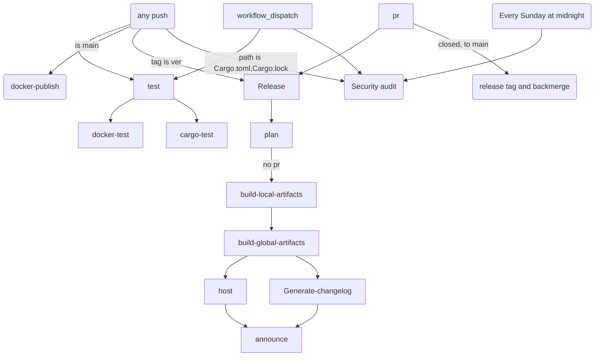

# CI/CD

```mermaid
flowchart TB
A(any push)
workflow_dispatch

workflow_dispatch --> test
A --> test
test --> docker-test
test --> cargo-test

A -->|is main| B(docker-publish)

A -->|tag is ver| Release
pr --> Release
Release --> plan -->|no pr| build-local-artifacts --> build-global-artifacts --> host --> announce
build-global-artifacts --> Generate-changelog --> announce

A -->|path is Cargo.toml,Cargo.lock| D(Security audit)
workflow_dispatch --> D
E(Every Sunday at midnight) --> D

pr -->|closed, to main| C(release tag and backmerge)
```
