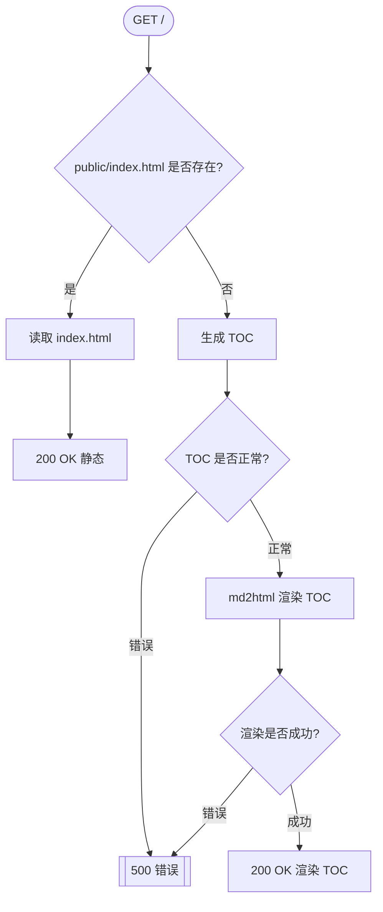

# Request Flow & Sequence

> WHY: 明确分支与数据派生点，便于调试、性能优化和安全审查。

> 最后更新时间：2025-12-13
> 适用版本：dev 分支
> 参见：`.github/copilot-instructions.md`（AI 编码代理完整指引）

## 1. Index 路由 (`/`)



WHY: 首页优先静态文件，缺失时自动生成 TOC，保证无论有无 index.html 都能访问。

Notes:

- `Cofg::new()` 仅初始化一次，配置全局缓存。
- TOC 生成频率低，无需缓存。

## 2. 通用路径路由 (`/{filename:.*}`)

```mermaid
flowchart TB
  A([GET /{filename}]) --> B[解码 URI]
  B --> C[拼接 public 路径]
  C --> D{文件是否存在?}
  D -->|否| E[加载 meta/404.html] --> F[[404 Not Found]]
  D -->|是| G{是否为 .md 文件?}
  G -->|否| H[静态文件流式返回] --> I[200 OK 静态]
  G -->|是| J[读取 Markdown] --> K[md2html 渲染] --> L{渲染是否成功?}
  L -->|错误| M[[500 错误]]
  L -->|成功| N[200 OK HTML]
```

WHY: 路径安全采用 canonicalize，优先 public 下查找，.md 文件走解析渲染，目录自动 TOC，404 可自定义。

## 3. md2html 内部流程

```text
engine = get_engine(cfg)       # hot_reload 时每次重建
ctx = get_context(cfg)
for extra var (如 path): set_context_value
ast = parser_md(markdown)
fragment = render_html(ast)
ctx.body = fragment
template = compile_to_bytecode(html-t.hbs)
final_html = render_compiled(template, ctx)
```

WHY: 保证 Markdown 动态渲染，无缓存，支持热重载和上下文扩展。

## 4. 关键缓存与上下文变量

每次请求扩展：

| Key          | Source Function        | Purpose                         |
| ------------ | ---------------------- | ------------------------------- |
| DecodedUri   | `cached_decoded_uri`   | 日志友好，百分号解码路径        |
| FilenamePath | `cached_filename_path` | 可复用的 PathBuf 路径参数       |
| TOC          | `get_toc`              | 目录树，目录请求时动态生成      |
| Engine       | `get_engine`           | Handlebars 模板引擎，支持热重载 |

WHY: 这些变量用于性能优化、日志追踪和上下文扩展，便于后续功能拓展。
| PublicReqPath | `cached_public_req_path` | Disk resolution anchor under `public_path` |
| IsMarkdown | `cached_is_markdown` | Branch predicate for dynamic vs static path |

Cross-request:

- HTML render cache in `parser::md2html` (enabled by `cache.enable_html`) keyed by `(abs_path, file_mtime, file_size, template_hbs_mtime, template_ctx_hash)`
- TOC cache in `parser::markdown::get_toc` (enabled by `cache.enable_toc`) keyed by `(dir_abs, dir_mtime, title)`

## 5. Error Points & Types

| Stage                   | Potential Error      | AppError Variant       |
| ----------------------- | -------------------- | ---------------------- |
| Reading index/markdown  | IO                   | Io                     |
| TOC glob build/walk     | Pattern / Walk       | GlobPattern / GlobWalk |
| Markdown parse          | nom errors           | MarkdownParse          |
| Template compile/render | mystical_runic error | Template               |
| Config load             | config crate error   | Config                 |

Unhandled bubbles produce 500 via `Responder` impl.

## 6. Timing Hotspots (Potential)

| Area                               | Reason                   | Mitigation Option                        |
| ---------------------------------- | ------------------------ | ---------------------------------------- |
| Repeated large markdown parse      | Many hits on large files | Add HTML cache keyed by mtime            |
| TOC generation on huge trees       | Deep directory structure | Precompute + watch or mtime memoize      |
| Template engine rebuild (dev only) | hot_reload true          | Acceptable trade-off; keep minimal logic |

## 7. Sequence Summary (Simplified)

```text
route -> resolve path -> exist?
  no -> 404 (custom) -> done
  yes -> md?
    no -> static file
    yes -> read -> md2html -> html -> respond
```

## See also

- Developer guide: ./developer-guide.md
- Key functions: ./key-functions.md
- Config ↔ Template map: ./config-templating-map.md
- Performance & caching: ./performance-cache.md
- IP filter: ./ip-filter.md
