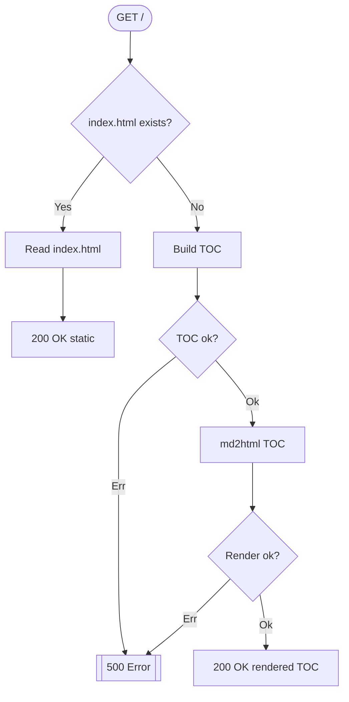
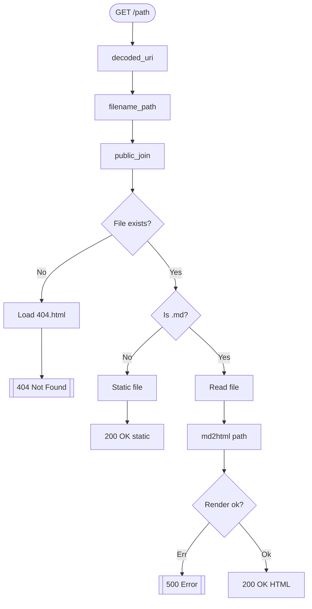

# Request Flow & Sequence

> WHY: Clarify branching & data derivation points to aid debugging and performance tuning.

## 1. Index Route (`/`)



Notes:

- `Cofg::new()` used once early; config cached.
- TOC generation frequency expected low; no caching needed initially.

## 2. Generic Path Route (`/{filename:.*}`)



## 3. md2html Internals

```text
engine = get_engine(cfg)       # maybe rebuild if hot_reload
ctx = get_context(cfg)
for extra var (e.g. path): set_context_value
ast = parser_md(markdown)
fragment = render_html(ast)
ctx.body = fragment
template = compile_to_bytecode(html-t.templating)
final_html = render_compiled(template, ctx)
```

## 4. Per-Request Cache Keys

| Key           | Source Function          | Purpose                                     |
| ------------- | ------------------------ | ------------------------------------------- |
| DecodedUri    | `cached_decoded_uri`     | Logging-friendly, percent-decoded path      |
| FilenamePath  | `cached_filename_path`   | Reusable path param as `PathBuf`            |
| PublicReqPath | `cached_public_req_path` | Disk resolution anchor under `public_path`  |
| IsMarkdown    | `cached_is_markdown`     | Branch predicate for dynamic vs static path |

## 5. Error Points & Types

| Stage                   | Potential Error      | AppError Variant       |
| ----------------------- | -------------------- | ---------------------- |
| Reading index/markdown  | IO                   | Io                     |
| TOC glob build/walk     | Pattern / Walk       | GlobPattern / GlobWalk |
| Markdown parse          | nom errors           | MarkdownParse          |
| Template compile/render | mystical_runic error | Template               |
| Config load             | config crate error   | Config                 |

Unhandled bubbles produce 500 via `Responder` impl.

## 6. Timing Hotspots (Potential)

| Area                               | Reason                   | Mitigation Option                        |
| ---------------------------------- | ------------------------ | ---------------------------------------- |
| Repeated large markdown parse      | Many hits on large files | Add HTML cache keyed by mtime            |
| TOC generation on huge trees       | Deep directory structure | Precompute + watch or mtime memoize      |
| Template engine rebuild (dev only) | hot_reload true          | Acceptable trade-off; keep minimal logic |

## 7. Sequence Summary (Simplified)

```text
route -> resolve path -> exist?
  no -> 404 (custom) -> done
  yes -> md?
    no -> static file
    yes -> read -> md2html -> html -> respond
```
